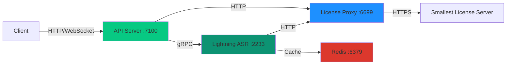
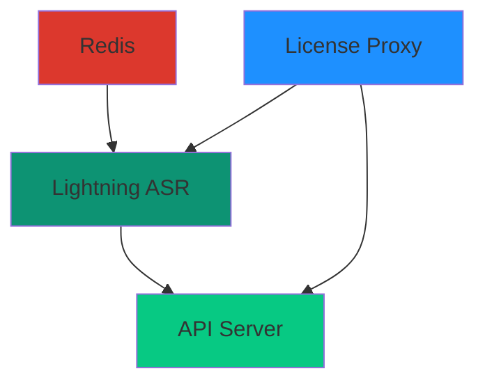

## Architecture

The Docker deployment consists of four main services that work together:



## API Server

The API Server is the main entry point for all client requests.

### Purpose

- Routes incoming API requests to Lightning ASR workers
- Manages WebSocket connections for streaming
- Handles request queuing and load balancing
- Provides unified API interface

### Container Details

<ParamField path="Image" type="string">
  `quay.io/smallestinc/self-hosted-api-server:latest`
</ParamField>

<ParamField path="Port" type="integer">
  `7100` - Main API endpoint
</ParamField>

<ParamField path="Resources" type="object">
  - CPU: 0.5-2 cores
  - Memory: 512 MB - 2 GB
  - No GPU required
</ParamField>

### Key Endpoints

<table style={{ borderCollapse: 'separate', borderSpacing: 0, width: '100%', borderRadius: '8px', overflow: 'hidden' }}>
  <thead>
    <tr style={{ backgroundColor: 'rgba(255, 255, 255, 0.08)' }}>
      <th style={{ padding: '12px 16px', textAlign: 'left', fontWeight: '800', border: '0.5px solid rgba(209, 213, 219, 0.2)', borderTopLeftRadius: '8px' }}>Endpoint</th>
      <th style={{ padding: '12px 16px', textAlign: 'left', fontWeight: '800', border: '0.5px solid rgba(209, 213, 219, 0.2)' }}>Method</th>
      <th style={{ padding: '12px 16px', textAlign: 'left', fontWeight: '800', border: '0.5px solid rgba(209, 213, 219, 0.2)', borderTopRightRadius: '8px' }}>Purpose</th>
    </tr>
  </thead>
  <tbody>
    <tr>
      <td style={{ padding: '12px 16px', border: '0.5px solid rgba(209, 213, 219, 0.2)' }}><code>/health</code></td>
      <td style={{ padding: '12px 16px', border: '0.5px solid rgba(209, 213, 219, 0.2)' }}>GET</td>
      <td style={{ padding: '12px 16px', border: '0.5px solid rgba(209, 213, 219, 0.2)' }}>Health check</td>
    </tr>
    <tr>
      <td style={{ padding: '12px 16px', border: '0.5px solid rgba(209, 213, 219, 0.2)' }}><code>/v1/listen</code></td>
      <td style={{ padding: '12px 16px', border: '0.5px solid rgba(209, 213, 219, 0.2)' }}>POST</td>
      <td style={{ padding: '12px 16px', border: '0.5px solid rgba(209, 213, 219, 0.2)' }}>Synchronous transcription</td>
    </tr>
    <tr>
      <td style={{ padding: '12px 16px', border: '0.5px solid rgba(209, 213, 219, 0.2)', borderBottomLeftRadius: '8px' }}><code>/v1/listen/stream</code></td>
      <td style={{ padding: '12px 16px', border: '0.5px solid rgba(209, 213, 219, 0.2)' }}>WebSocket</td>
      <td style={{ padding: '12px 16px', border: '0.5px solid rgba(209, 213, 219, 0.2)', borderBottomRightRadius: '8px' }}>Streaming transcription</td>
    </tr>
  </tbody>
</table>

### Environment Variables

```yaml
LICENSE_KEY: Your license key
LIGHTNING_ASR_BASE_URL: Internal URL to Lightning ASR
API_BASE_URL: Internal URL to License Proxy
```

### Logs

Key log messages:

```
✓ Connected to Lightning ASR at http://lightning-asr:2233
✓ License validation successful
✓ API server listening on port 7100
```

### Dependencies

- Requires Lightning ASR to be running
- Requires License Proxy for validation
- Optionally uses Redis for request coordination

## Lightning ASR

The core speech recognition engine powered by GPU acceleration.

### Purpose

- Performs audio-to-text transcription
- Processes both batch and streaming requests
- Manages GPU resources and model inference
- Handles audio preprocessing and postprocessing

### Container Details

<ParamField path="Image" type="string">
  `quay.io/smallestinc/lightning-asr:latest`
</ParamField>

<ParamField path="Port" type="integer">
  `2233` - ASR service endpoint
</ParamField>

<ParamField path="Resources" type="object">
  - CPU: 4-8 cores
  - Memory: 12-16 GB
  - **GPU: 1x NVIDIA GPU (16+ GB VRAM)**
</ParamField>

### GPU Requirements

Lightning ASR requires NVIDIA GPU with CUDA support:

<table style={{ borderCollapse: 'separate', borderSpacing: 0, width: '100%', borderRadius: '8px', overflow: 'hidden' }}>
  <thead>
    <tr style={{ backgroundColor: 'rgba(255, 255, 255, 0.08)' }}>
      <th style={{ padding: '12px 16px', textAlign: 'left', fontWeight: '800', border: '0.5px solid rgba(209, 213, 219, 0.2)', borderTopLeftRadius: '8px' }}>GPU Model</th>
      <th style={{ padding: '12px 16px', textAlign: 'left', fontWeight: '800', border: '0.5px solid rgba(209, 213, 219, 0.2)' }}>VRAM</th>
      <th style={{ padding: '12px 16px', textAlign: 'left', fontWeight: '800', border: '0.5px solid rgba(209, 213, 219, 0.2)', borderTopRightRadius: '8px' }}>Performance</th>
    </tr>
  </thead>
  <tbody>
    <tr>
      <td style={{ padding: '12px 16px', border: '0.5px solid rgba(209, 213, 219, 0.2)' }}>A100</td>
      <td style={{ padding: '12px 16px', border: '0.5px solid rgba(209, 213, 219, 0.2)' }}>40-80 GB</td>
      <td style={{ padding: '12px 16px', border: '0.5px solid rgba(209, 213, 219, 0.2)' }}>Excellent</td>
    </tr>
    <tr>
      <td style={{ padding: '12px 16px', border: '0.5px solid rgba(209, 213, 219, 0.2)' }}>A10</td>
      <td style={{ padding: '12px 16px', border: '0.5px solid rgba(209, 213, 219, 0.2)' }}>24 GB</td>
      <td style={{ padding: '12px 16px', border: '0.5px solid rgba(209, 213, 219, 0.2)' }}>Excellent</td>
    </tr>
    <tr>
      <td style={{ padding: '12px 16px', border: '0.5px solid rgba(209, 213, 219, 0.2)' }}>L4</td>
      <td style={{ padding: '12px 16px', border: '0.5px solid rgba(209, 213, 219, 0.2)' }}>24 GB</td>
      <td style={{ padding: '12px 16px', border: '0.5px solid rgba(209, 213, 219, 0.2)' }}>Very Good</td>
    </tr>
    <tr>
      <td style={{ padding: '12px 16px', border: '0.5px solid rgba(209, 213, 219, 0.2)', borderBottomLeftRadius: '8px' }}>T4</td>
      <td style={{ padding: '12px 16px', border: '0.5px solid rgba(209, 213, 219, 0.2)' }}>16 GB</td>
      <td style={{ padding: '12px 16px', border: '0.5px solid rgba(209, 213, 219, 0.2)', borderBottomRightRadius: '8px' }}>Good</td>
    </tr>
  </tbody>
</table>

### Environment Variables

```yaml
MODEL_URL: Download URL for ASR model
LICENSE_KEY: Your license key
REDIS_URL: Redis connection string
PORT: Service port (default 2233)
GPU_DEVICE_ID: GPU to use (for multi-GPU)
```

### Model Loading

On first startup, Lightning ASR:

1. Downloads model from MODEL_URL (~20 GB)
2. Validates model integrity
3. Loads model into GPU memory
4. Performs warmup inference

<Tip>
Use persistent volumes to cache models and avoid re-downloading on container restart.
</Tip>

### Logs

Key log messages:

```
✓ GPU detected: NVIDIA A10 (24GB)
✓ Downloading model from URL...
✓ Model loaded successfully (5.2GB)
✓ Warmup completed in 3.2s
✓ Server ready on port 2233
```

### Performance

Typical performance metrics:

<table style={{ borderCollapse: 'separate', borderSpacing: 0, width: '100%', borderRadius: '8px', overflow: 'hidden' }}>
  <thead>
    <tr style={{ backgroundColor: 'rgba(255, 255, 255, 0.08)' }}>
      <th style={{ padding: '12px 16px', textAlign: 'left', fontWeight: '800', border: '0.5px solid rgba(209, 213, 219, 0.2)', borderTopLeftRadius: '8px' }}>Metric</th>
      <th style={{ padding: '12px 16px', textAlign: 'left', fontWeight: '800', border: '0.5px solid rgba(209, 213, 219, 0.2)', borderTopRightRadius: '8px' }}>Value</th>
    </tr>
  </thead>
  <tbody>
    <tr>
      <td style={{ padding: '12px 16px', border: '0.5px solid rgba(209, 213, 219, 0.2)' }}>Real-time Factor</td>
      <td style={{ padding: '12px 16px', border: '0.5px solid rgba(209, 213, 219, 0.2)' }}>0.05-0.15x</td>
    </tr>
    <tr>
      <td style={{ padding: '12px 16px', border: '0.5px solid rgba(209, 213, 219, 0.2)' }}>Cold Start</td>
      <td style={{ padding: '12px 16px', border: '0.5px solid rgba(209, 213, 219, 0.2)' }}>30-60 seconds</td>
    </tr>
    <tr>
      <td style={{ padding: '12px 16px', border: '0.5px solid rgba(209, 213, 219, 0.2)' }}>Warm Inference</td>
      <td style={{ padding: '12px 16px', border: '0.5px solid rgba(209, 213, 219, 0.2)' }}>50-200ms latency</td>
    </tr>
    <tr>
      <td style={{ padding: '12px 16px', border: '0.5px solid rgba(209, 213, 219, 0.2)', borderBottomLeftRadius: '8px' }}>Throughput</td>
      <td style={{ padding: '12px 16px', border: '0.5px solid rgba(209, 213, 219, 0.2)', borderBottomRightRadius: '8px' }}>100+ hours/hour (A10)</td>
    </tr>
  </tbody>
</table>

### Dependencies

- Requires License Proxy for validation
- Requires Redis for request coordination
- Requires NVIDIA GPU

## License Proxy

Validates license keys and reports usage to Smallest servers.

### Purpose

- Validates license keys on startup
- Reports usage metadata to Smallest
- Provides grace period for offline operation
- Acts as licensing gateway for all services

### Container Details

<ParamField path="Image" type="string">
  `quay.io/smallestinc/license-proxy:latest`
</ParamField>

<ParamField path="Port" type="integer">
  `6699` - License validation endpoint (internal)
</ParamField>

<ParamField path="Resources" type="object">
  - CPU: 0.25-1 core
  - Memory: 256-512 MB
  - No GPU required
</ParamField>

### Environment Variables

```yaml
LICENSE_KEY: Your license key
```

### Network Requirements

<Warning>
License Proxy requires outbound HTTPS access to:
- `console-api.smallest.ai` on port 443

Ensure your firewall allows these connections.
</Warning>

### Validation Process

1. On startup, validates license key with Smallest servers
2. Receives license terms and quotas
3. Caches validation (valid for grace period)
4. Periodically reports usage metadata

### Usage Reporting

License Proxy reports only metadata:

<table style={{ borderCollapse: 'separate', borderSpacing: 0, width: '100%', borderRadius: '8px', overflow: 'hidden' }}>
  <thead>
    <tr style={{ backgroundColor: 'rgba(255, 255, 255, 0.08)' }}>
      <th style={{ padding: '12px 16px', textAlign: 'left', fontWeight: '800', border: '0.5px solid rgba(209, 213, 219, 0.2)', borderTopLeftRadius: '8px' }}>Data Reported</th>
      <th style={{ padding: '12px 16px', textAlign: 'left', fontWeight: '800', border: '0.5px solid rgba(209, 213, 219, 0.2)', borderTopRightRadius: '8px' }}>Example</th>
    </tr>
  </thead>
  <tbody>
    <tr>
      <td style={{ padding: '12px 16px', border: '0.5px solid rgba(209, 213, 219, 0.2)' }}>Audio duration</td>
      <td style={{ padding: '12px 16px', border: '0.5px solid rgba(209, 213, 219, 0.2)' }}>3600 seconds</td>
    </tr>
    <tr>
      <td style={{ padding: '12px 16px', border: '0.5px solid rgba(209, 213, 219, 0.2)' }}>Request count</td>
      <td style={{ padding: '12px 16px', border: '0.5px solid rgba(209, 213, 219, 0.2)' }}>150 requests</td>
    </tr>
    <tr>
      <td style={{ padding: '12px 16px', border: '0.5px solid rgba(209, 213, 219, 0.2)' }}>Features used</td>
      <td style={{ padding: '12px 16px', border: '0.5px solid rgba(209, 213, 219, 0.2)' }}>streaming, punctuation</td>
    </tr>
    <tr>
      <td style={{ padding: '12px 16px', border: '0.5px solid rgba(209, 213, 219, 0.2)', borderBottomLeftRadius: '8px' }}>Response codes</td>
      <td style={{ padding: '12px 16px', border: '0.5px solid rgba(209, 213, 219, 0.2)', borderBottomRightRadius: '8px' }}>200, 400, 500</td>
    </tr>
  </tbody>
</table>

<Note>
**No audio or transcript data is transmitted** to Smallest servers.
</Note>

### Offline Mode

If connection to license server fails:

- Uses cached validation (24-hour grace period)
- Continues serving requests
- Logs warning messages
- Retries connection periodically

### Logs

Key log messages:

```
✓ License validated successfully
✓ License valid until: 2024-12-31
✓ Server listening on port 6699
⚠ Connection to license server failed, using cached validation
```

## Redis

Provides caching and state management for the system.

### Purpose

- Request queuing and coordination
- Session state for streaming connections
- Caching of frequent requests
- Performance optimization

### Container Details

<ParamField path="Image" type="string">
  `redis:latest` or `redis:7-alpine`
</ParamField>

<ParamField path="Port" type="integer">
  `6379` - Redis protocol
</ParamField>

<ParamField path="Resources" type="object">
  - CPU: 0.5-1 core
  - Memory: 512 MB - 1 GB
  - No GPU required
</ParamField>

### Configuration Options

<Tabs>
  <Tab title="Embedded Redis">
    Default configuration with minimal setup:
    ```yaml
    redis:
      image: redis:latest
      ports:
        - "6379:6379"
    ```
  </Tab>

  <Tab title="With Persistence">
    Enable data persistence:
    ```yaml
    redis:
      image: redis:latest
      command: redis-server --appendonly yes
      volumes:
        - redis-data:/data
    ```
  </Tab>

  <Tab title="With Authentication">
    Add password protection:
    ```yaml
    redis:
      image: redis:latest
      command: redis-server --requirepass ${REDIS_PASSWORD}
    ```
  </Tab>

  <Tab title="External Redis">
    Use external Redis instance:
    ```yaml
    environment:
      REDIS_URL: redis://external-host:6379
    ```
    Remove Redis service from docker-compose.yml
  </Tab>
</Tabs>

### Data Stored

Redis stores:

- Request queue state
- WebSocket session data
- Temporary audio chunks (streaming)
- Worker status and health

<Note>
Data in Redis is temporary and can be safely cleared. No persistent state is stored.
</Note>

### Health Check

Built-in health check:

```yaml
healthcheck:
  test: ["CMD", "redis-cli", "ping"]
  interval: 5s
  timeout: 3s
  retries: 5
```

## Service Dependencies

Startup order and dependencies:



### Recommended Startup Sequence

1. **Redis** - Starts immediately (5 seconds)
2. **License Proxy** - Validates license (10-15 seconds)
3. **Lightning ASR** - Downloads/loads model (30-600 seconds)
4. **API Server** - Connects to services (5-10 seconds)

## Resource Planning

### Minimum Configuration

For development/testing:

```yaml
Total Resources:
  CPU: 6 cores
  Memory: 16 GB
  GPU: 1x T4 (16 GB VRAM)
  Storage: 100 GB
```

### Production Configuration

For production workloads:

```yaml
Total Resources:
  CPU: 12 cores
  Memory: 32 GB
  GPU: 1x A10 (24 GB VRAM)
  Storage: 200 GB
```

### Multi-Worker Configuration

For high-volume production:

```yaml
Total Resources:
  CPU: 24 cores
  Memory: 64 GB
  GPU: 2x A10 (24 GB VRAM each)
  Storage: 300 GB
```

## Monitoring

### Container Health

Check container status:

```bash
docker compose ps
```

### Resource Usage

Monitor resource consumption:

```bash
docker stats
```

### GPU Usage

Monitor GPU utilization:

```bash
watch -n 1 nvidia-smi
```

### Logs

View service logs:

```bash
docker compose logs -f [service-name]
```

## What's Next?

<CardGroup cols={2}>
  <Card title="STT Configuration" icon="gear" href="/v4.0.0/content/on-prem/docker/stt/configuration">
    Customize service configuration and resource allocation
  </Card>

  <Card title="STT Troubleshooting" icon="wrench" href="/v4.0.0/content/on-prem/docker/stt/docker-troubleshooting">
    Debug issues and optimize performance
  </Card>
</CardGroup>

