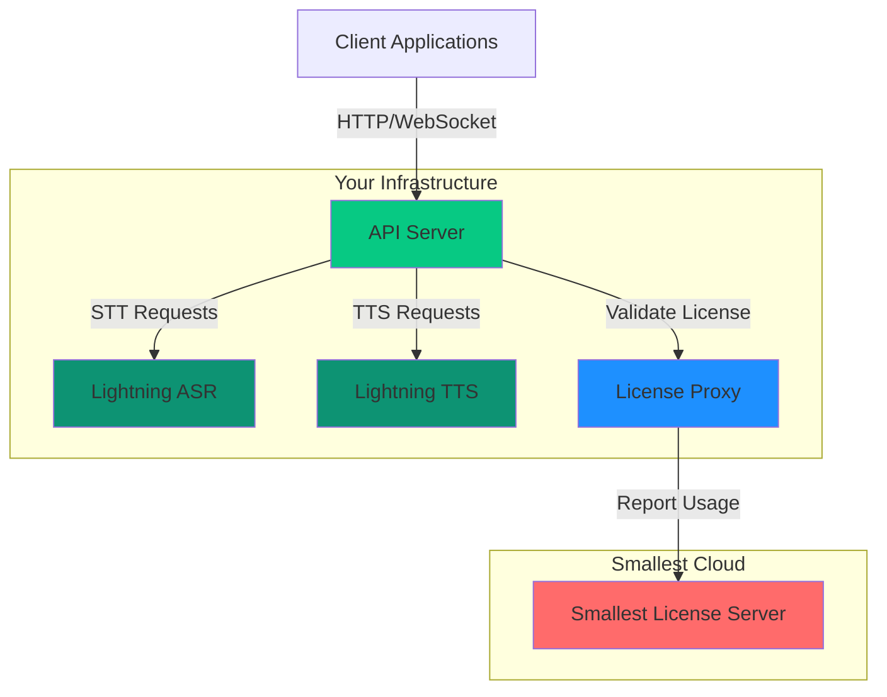

## System Architecture

## Components

<AccordionGroup>
  <Accordion title="API Server" icon="server">
    Routes requests to Lightning ASR/TTS workers, manages WebSocket connections, and provides a unified REST API interface.
    
    **Resources:** 0.5-2 CPU cores, 512 MB - 2 GB RAM, no GPU
  </Accordion>

  <Accordion title="Lightning ASR" icon="microphone">
    GPU-accelerated speech-to-text engine with 0.05-0.15x real-time factor. Supports real-time and batch transcription.
    
    **Resources:** 4-8 CPU cores, 12-16 GB RAM, 1x NVIDIA GPU (16+ GB VRAM)
  </Accordion>

  <Accordion title="Lightning TTS" icon="volume-high">
    GPU-accelerated text-to-speech engine for natural voice synthesis. Supports streaming and batch generation.
    
    **Resources:** 4-8 CPU cores, 12-16 GB RAM, 1x NVIDIA GPU (16+ GB VRAM)
  </Accordion>

  <Accordion title="License Proxy" icon="key">
    Validates license keys and reports usage metadata. Supports offline grace periods.
    
    **Resources:** 0.25-1 CPU core, 256-512 MB RAM, no GPU
  </Accordion>

  <Accordion title="Redis" icon="database">
    Request queuing, session state, and caching. Can use embedded or external (ElastiCache).
    
    **Resources:** 0.5-1 CPU core, 512 MB - 2 GB RAM, no GPU
  </Accordion>
</AccordionGroup>

## Data Flow

1. **Client Request** — Your application sends audio (STT) or text (TTS) via HTTP or WebSocket
2. **API Server** — Routes the request to the appropriate worker and validates the license
3. **Worker Processing** — Lightning ASR or TTS processes the request on GPU
4. **Response** — Results stream back through the API server to your application

All processing happens within your infrastructure. Only license validation metadata is sent to Smallest Cloud.

## What's Next?

<CardGroup cols={2}>
  <Card title="Prerequisites" icon="list-check" href="/v4.0.0/content/on-prem/getting-started/prerequisites">
    License key, credentials, and infrastructure requirements
  </Card>
  <Card title="Why Self-Host?" icon="server" href="/v4.0.0/content/on-prem/getting-started/why-self-host">
    Benefits of self-hosting for your use case
  </Card>
</CardGroup>
